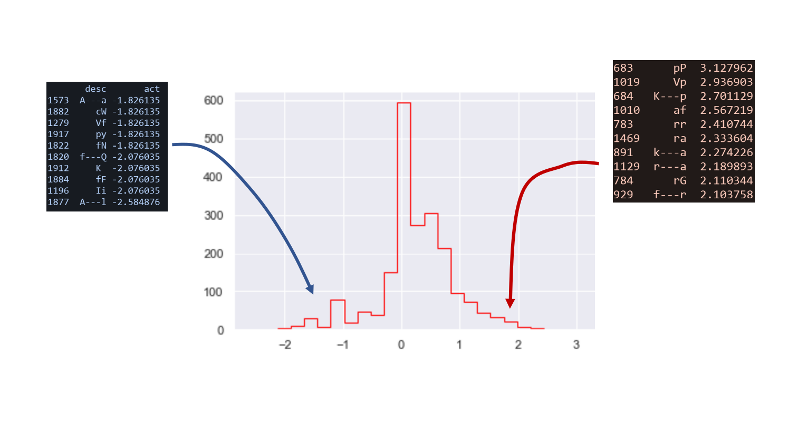
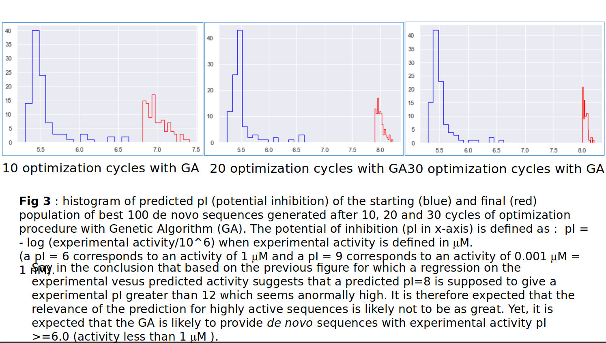
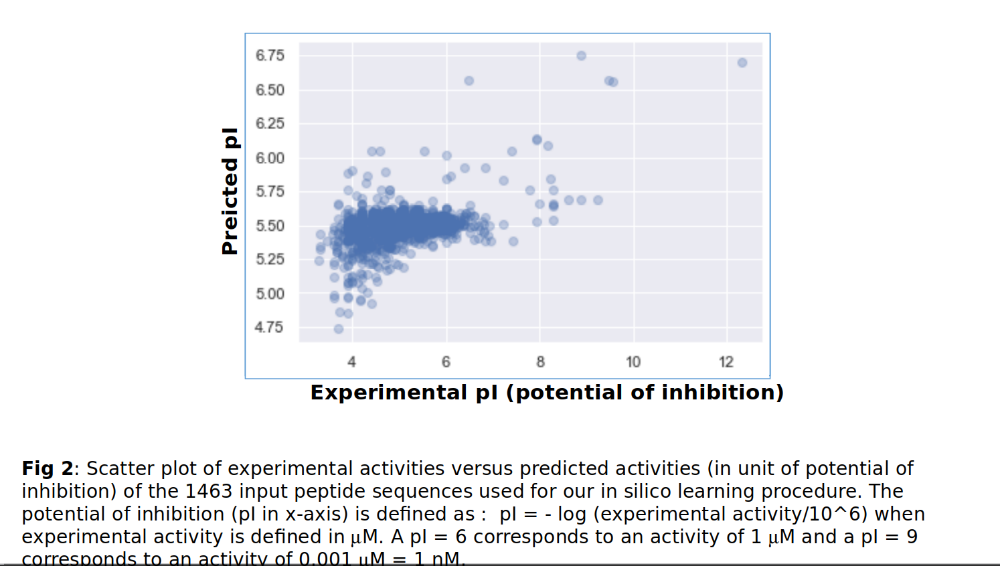

# Optimal design of antimicrobial peptides using a Genetic Algorithm based on supervised models

*Jeremy Guerreroa, Francesca Rivasa, Yangzuo Wang a, Cheng Wena
Sup’Biotech - Biotechnology Engineering School, Villejuif, France*

## Abstract
New machine learning techniques using Naïve
Bayesian and XGBoost classifiers, and a Genetic Algorithm is
presented for optimal design of antimicrobial peptides with
activity against cancer cells. The Naïve Bayesian classifier
discriminates sequence-relative descriptors, and the XGBoost
classifier discriminates physicochemical descriptors well
selected using a database of more than two thousands active and
inactive anticancer peptides. Using these descriptors, we update
the sequence of already active peptides with a driven genetic
algorithm. The algorithm is optimizing the global score of each
peptide by in-silico replacement of single or paired amino acids
that were found the most frequently observed in optimal
peptides. The best peptide will be experimentally validated in a
laboratory environment on cancer cell lines.
Keywords — Antimicrobial peptides (AMPs), descriptors, Naïve
Bayesian, XGBoost, Genetic Algorithm (GA).

## RESULTS PREVIEW

## DISCUSSION AND PERSPECTIVES
Taking the physicochemical characteristics as descriptors, a
better supervised classification model is achieved. By making
use of DBAASP and the BioPython package, features of
great importance can be obtained to determine whether a
peptide (ACP or other) will be Stable or Unstable. This,
incorporated in the XGBoost algorithm, generates a better
accuracy score (89.77%) compared to the algorithm based on
Bayes’ theorem. Physicochemical properties are values
produced from the general conformation of the peptide. In
other words, not only the probability that an amino acid or
dipeptide is in a specific class is taken into account, but also
its position and interaction with the other amino acid residues
around it. This given that the properties have been obtained
from various formulas and models previously validated both
in-silico and in-vitro [18, 19].
After being dealt with by the Naïve Bayesian method, several
descriptors for each peptide were obtained. Instead of
screening the descriptors and selecting those that contribute a
lot to the stable peptide, all of them were contained in our
model, which is quite different from the QSAR process. As it
is well known, the more descriptors a QSAR has, the more R2
it will get, which means the model is probably overestimated.
However, in our project, we use the log to calculate the score
for each peptide. Thus, in our model, there is a penalty
system and when the descriptor is not good enough, it won’t
make any contribution to the activity, and will decrease the
probability of being stable. As a consequence, it will be even
harder to get a negative or high score for peptides. Besides,
even if we consider the bad descriptors as noise, as long as
we have enough training tests, the average score of the noise
will be around 0. Then, it won’t have any influence on the
final result. Nonetheless, the final Naïve Bayesian model
does not have a good accuracy score (67%), but it is
indispensable for developing emergent descriptor libraries.
Which later serves for the execution of the GA. This
approach is similar to that carried out by Guruprasad et al.
[7], with the difference that our model considers the count of
dipeptides and 4-gap peptides. Owing to the GA, we
increased the average stability score of the peptides and got
optimized peptides. However, there are some problems
remaining to be solved. The first one is that the length of the
de novo peptides has the tendency to be longer after each
cycle, which means a criteria for the length is probably
necessary in this method. Additionally, the code should be
optimized to decrease the running time.
For future work, it is recommended to comprehend in greater
depth the function of dipeptides and 4-gap peptides in protein
structures. Thus, we can iterate the Naïve Bayesian classifier
developed in the paper and make the GA more precise. Some
laboratory experiments would help us to verify if the
optimized peptides truly have higher activity. As a result, the
experimental data can improve our model and make it a
powerful tool to discover new ACPs.CONCLUSION
This paper presents two supervised machine learning models
to classify peptides with anticancer activity according to the
Instability index. These two approaches are based on a
Gradient Boosting model with a dataset that includes
physicochemical properties (Table I and II), and on a Naïve
Bayesian model with the creation of libraries with emergent
descriptors. The XGBoost algorithm was chosen as the best
prediction model due to the creation of a Decision True that
considers diverse numerical features related to the behaviour
of the peptide structure. The Naïve Bayesian algorithm
focuses more on the sequence of peptides rather than their
properties, which provides another way to predict the
stability of peptides. Still, it requires more precision in the
selection of its emergent descriptors to be an enhanced
prediction model. However, for the optimization of the
ACPs, a new Genetic Algorithm was developed based on a
Bayesian score. With this, we simulate in-silico the natural
mutation of organisms until obtaining the sequence with the
best score.

## ACKNOWLEDGEMENTS

We would like to thank our tutors, especially Dr. Jean-Yves
TROSSET and Dr. Patrick GONZALES for their numerous
advice during the whole process.To read the entire manuscript please refer to the AMP-Fil rouge.pdf file in the repo

## REFERENCES

[1] Y. Huan, Q. Kong, H. Mou and H. Yi, "Antimicrobial
Peptides: Classification, Design, Application and Research
Progress in Multiple Fields", Frontiers in Microbiology, vol.
11, 2020. Available: 10.3389/fmicb.2020.582779 [Accessed
23 December 2021].
[2] R. Kundu, “Cationic
nature-inspired
synthetic
ChemMedChem.
Available:
[Accessed: 22 December 2021]
amphiphilic peptide: A
antimicrobial
peptide”,
10.1002/cmdc.202000301
[3] S. Gad, "QSAR", Encyclopedia of Toxicology, pp. 1-9,
2014.
Available: 10.1016/b978-0-12-386454-3.00971-4
[Accessed 23 December 2021].
[4] G. Gogoladze et al., "dbaasp: database of antimicrobial
activity and structure of peptides", FEMS Microbiology
Letters, vol. 357, no. 1, pp. 63-68, 2014. Available:
10.1111/1574-6968.12489 [Accessed 23 December 2021].
[5] H. Nam et al., "Helicity Modulation Improves the
Selectivity of Antimicrobial Peptoids", ACS Infectious
Diseases, vol. 6, no. 10, pp. 2732-2744, 2020. Available:
10.1021/acsinfecdis.0c00356 [Accessed 23 December 2021].
[6] J. Cross, "MEDLINE, PubMed, PubMed Central, and the
NLM", Editors' Bulletin, vol. 2, no. 1, pp. 1-5, 2006.
Available: 10.1080/17521740701702115.
[7] K. Guruprasad, B. Reddy and M. Pandit, "Correlation
between stability of a protein and its dipeptide composition: a
novel approach for predicting in vivo stability of a protein
from its primary sequence", "Protein Engineering, Design
and Selection", vol. 4, no. 2, pp. 155-161, 1990. Available:
10.1093/protein/4.2.155 [Accessed 23 December 2021].
[8] D. Gamage, A. Gunaratne, G. Periyannan and T. Russell,
"Applicability of Instability Index for In vitro Protein
Stability Prediction", Protein & Peptide Letters, vol. 26, no.
5,
pp.
339-347,
2019.
Available:
10.2174/0929866526666190228144219
[Accessed
23
December 2021].
[9] Y. Jin et al., "Antimicrobial Activities and Structures of
Two Linear Cationic Peptide Families with Various
Amphipathic
β-Sheet
and
α-Helical
Potentials",
Antimicrobial Agents and Chemotherapy, vol. 49, no. 12, pp.
4957-4964,
2005.
Available:
10.1128/aac.49.12.4957-4964.2005 [Accessed 23 December
2021].
[10] "Classification Algorithm in Machine Learning -
Javatpoint", www.javatpoint.com, 2021. [Online]. Available:
https://www.javatpoint.com/classification-algorithm-in-mach
ine-learning. [Accessed: 23- Dec- 2021].
[11] T. Chen and C. Guestrin, "XGBoost", Proceedings of the
22nd ACM SIGKDD International Conference on
Knowledge Discovery and Data Mining, 2016. Available:
10.1145/2939672.2939785 [Accessed 23 December 2021].
[12] Gradient Boost Machine Learning|How Gradient boost
work in Machine Learning. India: Unfold Data Science,
2020.
[13] Maths behind XGBoost|XGBoost algorithm explained
with Data Step by Step. India: Unfold Data Science, 2020.
[14] "XGBoost Parameters — xgboost 1.5.1 documentation",
Xgboost.readthedocs.io,
2021.
[Online].
Available:
https://xgboost.readthedocs.io/en/stable/parameter.html.
[Accessed: 23- Dec- 2021].
[15] "1.9. Naive Bayes", scikit-learn, 2021. [Online].
Available:
https://scikit-learn.org/stable/modules/naive_bayes.html.
[Accessed: 23- Dec- 2021].
[16] M. Albadr, S. Tiun, M. Ayob and F. AL-Dhief, "Genetic
Algorithm Based on Natural Selection Theory for
Optimization Problems", Symmetry, vol. 12, no. 11, p. 1758,
2020. Available: 10.3390/sym12111758 [Accessed 23
December 2021].
[17] 高扬, 卫诤, 尹会生, 白话大数据与机器学习, 2016, 机
器工业出版社, 329 pp..[18] D. Eisenberg, R. Weiss and T. Terwilliger, "The helical
hydrophobic moment: a measure of the amphiphilicity of a
helix", Nature, vol. 299, no. 5881, pp. 371-374, 1982.
Available: 10.1038/299371a0 [Accessed 24 December 2021].
[19] "Peptide calculator", Pepcalc.com, 2021. [Online].
Available: http://pepcalc.com/notes.php?all. [Accessed: 24
December 2021].
